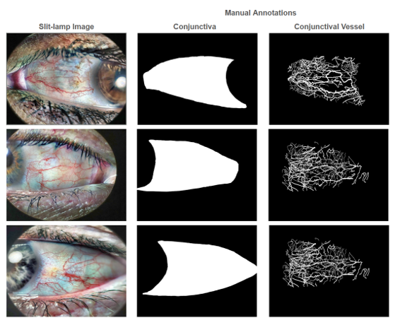
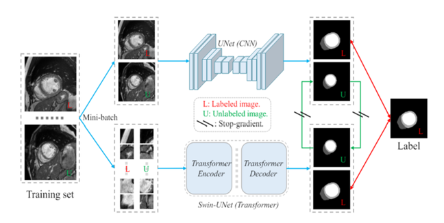
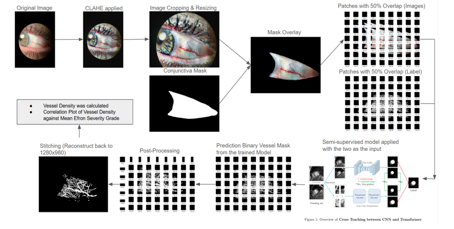
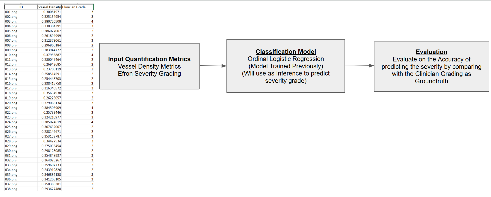
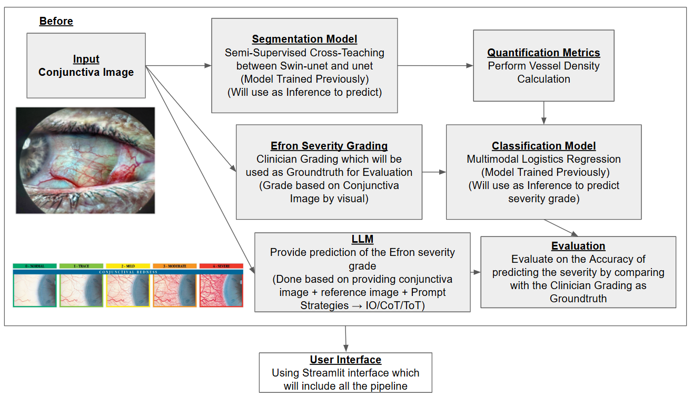
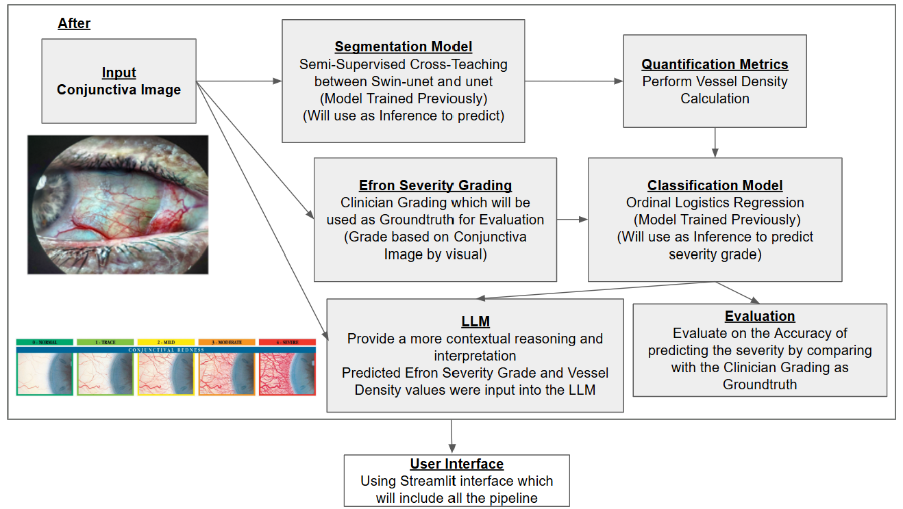

### <<<<<<<<<<<<<<<<<<<< Start of Template >>>>>>>>>>>>>>>>>>>>

---

## SECTION 1 : PROJECT TITLE
## <p align="justify"> Development of an Intelligent Platform for Automated Conjunctival Vessel Segmentation, Efron Severity Classification & LLM-Assisted Clinical Interpretation
</p>

---

## Section 2 : PROJECT SUMMARY

<p align="justify">
This project presents an end-to-end automated platform for conjunctival hyperaemia Efron severity grading, where conjunctival vessels are extracted automatically through a Semi-Supervised Learning segmentation model, severity is classified using Ordinal Logistic Regression, and clinical interpretation is generated automatically via a Large Language Model — all integrated into a single clinician-friendly Streamlit interface accessible to any clinician without requiring technical expertise.
</p>

<p align="justify">
Conjunctival hyperaemia is the redness of the white part of the eye which is a key clinical indicator of dry eye disease severity. Current grading practice relies on manual visual assessment by clinicians using the Efron grading scale (Grade 0 to Grade 4) , which is highly subjective and prone to inter-observer variability. This project addresses this gap by developing an intelligent platform that automates the entire grading pipeline and extraction of the vascular structure, reducing inter-observer variability, supporting faster diagnostic decisions and improving consistency in conjunctival hyperaemia grading in real-world ophthalmology settings.
</p>

<table>
  <tr>
    <td align="center"><strong>Images</strong></td>
    <td align="center"><strong>Reference Images for Efron severity grading</strong></td>
  </tr>
  <tr>
    <td></td>
    <td></td>
  </tr>
</table>

---

## Section 3 : SYSTEM PIPELINE

### 3.1 Semi-Supervised Learning (SSL) Segmentation

<p align="justify">
The platform integrates three core components. First, a Semi-Supervised Learning (SSL) segmentation model based on a cross-teaching framework between UNet and Swin-UNet extracts conjunctival vascular structure from slit-lamp images, achieving an IoU of 0.522 with limited annotated data. The process begins with the original conjunctival slit-lamp image which undergoes Contrast Limited Adaptive Histogram Equalization (CLAHE) to enhance image contrast and improve vessel visibility. A conjunctival mask is then applied to isolate the region of interest. The masked image is then divided into 256×256 pixel patches using a sliding window approach with 50% overlap, generating both image patches and their corresponding binary vessel label patches. These patches are fed into the SSL segmentation model, which produces predicted binary vessel masks for each patch. uring inference, the best saved model is loaded and applied to the unseen image patches to produce predicted binary vessel masks for each patch. The predicted patches then undergo post-processing before being stitched back together to reconstruct the full binary vessel mask at the original image resolution of 1280×980 pixels. The reconstructed vessel mask is subsequently used to calculate the vessel density value, which is then used to generate a correlation plot of vessel density against the mean Efron severity grade for evaluation. A key advantage of the SSL approach is that the segmentation pipeline is fully automated — once trained, the model is capable of extracting conjunctival vessel structures directly from raw slit-lamp images without requiring any manual annotation or expert labelling, making it highly scalable and practical for real-world clinical deployment where annotated data is scarce and expensive to obtain. 
</p>

<table>
  <tr>
    <td align="center"><strong>SSL Model</strong></td>
    <td align="center"><strong>Process training SSL Model</strong></td>
  </tr>
  <tr>
    <td></td>
    <td></td>
  </tr>
</table>

### 3.2 Classification Model

<p align="justify">
Second, an Ordinal Logistic Regression classification model maps the extracted vessel density to an Efron severity grade. Ordinal Logistic Regression was selected as the classification model as it is specifically designed for ordered categorical outcomes, explicitly respecting the 
natural ordering of the Efron severity scale from Grade 0 to Grade 4, unlike standard multiclass classification models such as Support Vector Machine, Random Forest and K-Nearest Neighbours which treat each grade as an independent unordered category. The model was trained on a dataset 
of 633 images with balanced class weighting applied to account for the unequal distribution of samples across severity grades and evaluated on a separate held-out test set of 32 unseen images.

The model achieved an overall accuracy of 78.1% and a Pearson correlation of 0.934 between the predicted vessel density and the model-predicted Efron severity grades on the 32 unseen test images, surpassing the clinician ground truth benchmark correlation of 0.854. This suggests 
that the model has learned a highly consistent and systematic mapping between vessel density and Efron severity grade — one that is more internally consistent than human grading which is naturally subject to subjective inter-observer variability. The higher correlation observed 
between predicted vessel density and model-predicted grades compared to clinician grades further validates the use of vessel density as a reliable and objective biomarker for Efron severity classification. 
</p>

<table align="center">
  <tr>
    <td align="center">
      <strong>Process training Ordinal Logistic Regression Classification Model</strong>
    </td>
  </tr>
  <tr>
    <td align="center">
      
    </td>
  </tr>
</table>

### 3.3 LLM-Assisted Clinical Explanation

<p align="justify">
The system was initially designed with LLM-based grading in mind, where the two multimodal LLM — ChatGPT v4.0 and Claude Sonnet v3.5 were evaluated for their ability to predict the Efron Severity grade by visually comparing the input conjunctival image against reference images across three prompting strategies — Input-Output (IO), Chain-of-Thought (CoT), and Tree-of-Thought (ToT). However, upon evaluation, the LLM grading results were outperformed by the conventional Ordinal Logistic Regression classification model, which achieved a Pearson correlation of 0.934 compared to the best LLM correlation of 0.631 (Claude Sonnet v3.5, CoT). 
</p>

<p align="justify">
Based on these results, an evidence-based decision was made to repurpose the LLM as a clinical explainer rather than a primary grader, which is a more appropriate and clinically valuable use of its capability. In the final pipeline, Claude Sonnet v3.5 via API key is integrated as the 
clinical explainer, where the predicted Efron severity grade from Ordinal Logistic Regression classification model and the corresponding vessel density value are passed into the LLM  together with structured prompt. LLM then generates a natural language clinical report covering the clinical interpretation of the predicted grade, management recommendations, lifestyle advice for the patient, recommended follow-up actions and red flags for the clinician should watch out for. This transforms the system from a simple classifier into an interactive clinical decision support tool, providing clinicians with a complete and actionable grading report without 
requiring any manual interpretation. Nevertheless, the use of LLMs to predict Efron severity grades remains a promising direction for future work, particularly with domain-specific fine-tuning on annotated conjunctival grading datasets.
</p>

<p align="justify">
Due to the time constraints, fine-tuning of the LLM was not performed and by using the different prompt strategies such as IO, CoT and ToT alongside with the reference image was insufficient as the model like ChatGPT v4.0 and Claude Sonnet v3.5 relied entirely on prompt engineering and reference images without any task-specific adaptation. The method of prompting strategies significantly influenced the grading performance resulting in lower performance. However, LLM used to predict the Efron severity grades remains as the promising direction in future work.
</p>

<table>
  <tr>
    <td></td>
    <td></td>
  </tr>
</table>

---

## SECTION 4 : CREDITS / PROJECT CONTRIBUTION

| Official Full Name  | Student ID (MTech Applicable)  | Work Items (Who Did What) | Email (Optional) |
| :------------ |:---------------:| :-----| :-----|
| Yvonne Ng Bei Zhen | A0339813X | All parts of the project are completely alone| yvonne.ng.b.z@u.nus.edu.sg |

---

## SECTION 5 : USER GUIDE

`Refer to appendix <Installation & User Guide> in project report at Github Folder: Project Report`

### Installation of the packages

**Step 1 — Clone the repository using Command Prompt**
```bash
git clone https://github.com/yvonneng996/Automation-of-Conjunctival-Project-Pipeline.git
```
**Step 2 — Change File directory in Command Prompt**
```bash
cd Automation-of-Conjunctival-Project-Pipeline
```
**Step 3 — Create and activate conda environment via Anaconda Prompt**
```bash
conda env create -f environment.yml
conda activate test
```
**Step 4 — Verify installation**
```bash
conda list
```
### Running the Streamlit Application
**Step 5 — Run the Streamlit interface via Anaconda Prompt**
```bash
streamlit run -file directory/project_mtech.py
```
<table>
  <tr>
    <td></td>
     </tr>
</table>

### Streamlit Interface Usage

1) Upload a conjunctival slit-lamp image. Click "Upload Image 1" & "Browse files"
2) Upload a conjunctival binary mask. Click "Upload Image 2" & " Browse files"
3) Generate Output. Click on "Segmentation Process"
4) Output will show the extracted vessel mask, vessel density value, predicted Efron severity grade, LLM-generated clinical report

---
## SECTION 6 : PROJECT REPORT

`Refer to project report at Github Folder: ProjectReport`

**Recommended Sections for Project Report:**
- System Architecture Design
- Implementation
- Results
- Discussion
- Conclusion
- Limitations
- Future Work
- Appendix of report: Project Proposal
- Appendix of report: AI Usage Declaration

---

### <<<<<<<<<<<<<<<<<<<< End of Template >>>>>>>>>>>>>>>>>>>>

---

